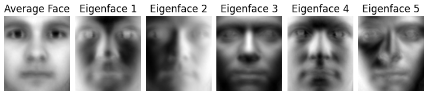
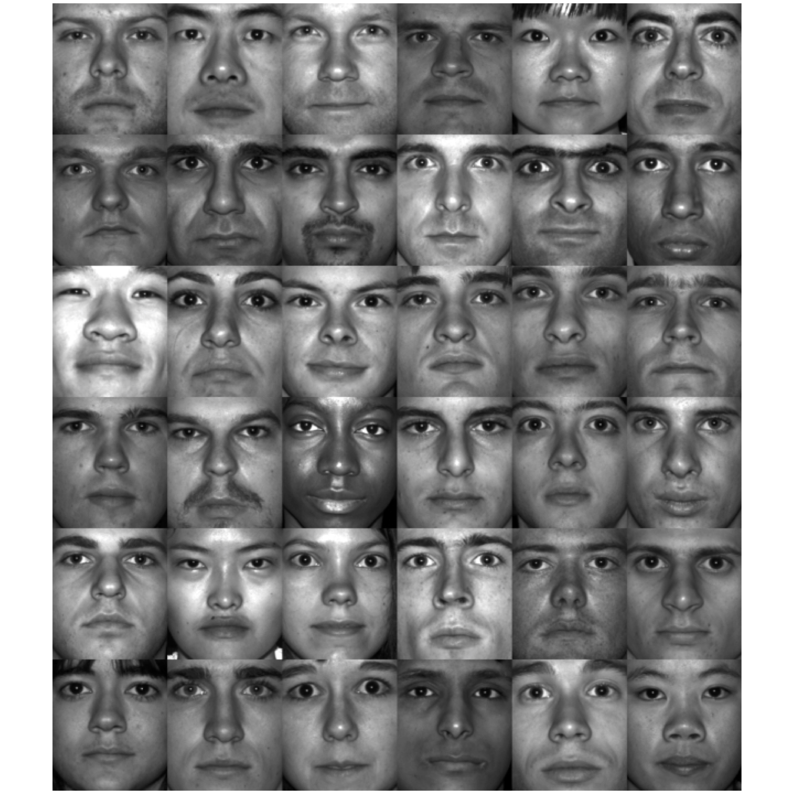

# Autoencoders vs PCA for Facial Recognition

Principal component analysis (PCA) is an example of dimensionality reduction.
Autoencoders generalize the idea to non-linear transformations. I have compared
the two approaches' ability for feature generation in facial recognition tasks.

The interactive Jupyter notebooks discover underlying structures with PCA and
Facebook's _DeepFace_ model and performs facial recognition on the _Yale Data
Base B_.

## Dataset

The experimentation is performed on the [Extended Yale Dataset
B](http://vision.ucsd.edu/~leekc/ExtYaleDatabase/ExtYaleB.html). But a
preprocessed version is already included in the repository.

## Notebooks

For optimal insights in the algorithms (especially PCA), the notebooks should be
viewed in the following order:
1. [`yalesfaces.ipynb`](code/yalefaces.ipynb): Get an overview on the
   dataset's distribution
2. [`eigenfaces.ipynb`](code/eigenfaces.ipynb): Explore how PCA decomposes face
   images into eigenfaces and understand their intuitive meaning
3. [`PCA.ipynb`](code/PCA.ipynb): Perform facial recognition with PCA generated
   features
4. [`Autoencoder.ipynb`](code/Autoencoder.ipynb): Perform facial recognition
   with Autoencoder generated features

### Requirements

In order to run the notebooks, you will need the following packages
in your python environment:
- openCV
- tensorflow
- scipy

## Report

The accompanying report is automatically built on every push with _GitHub
actions_ and can be found as `Report.pdf` from the latest build
[here](https://github.com/heliumind/eigenfaces/actions).

## Acknowledgments
This is my final project for the lab course _Python for Engineering Data
Analysis - from Machine Learning to Visualization_ offered by the Associate
Professorship Simulation of Nanosystems for Energy Conversion at the Technical
University of Munich.

I want to thank everyone responsible for this course, giving me a very hands-on
introduction to Data Science and Machine Learning.
